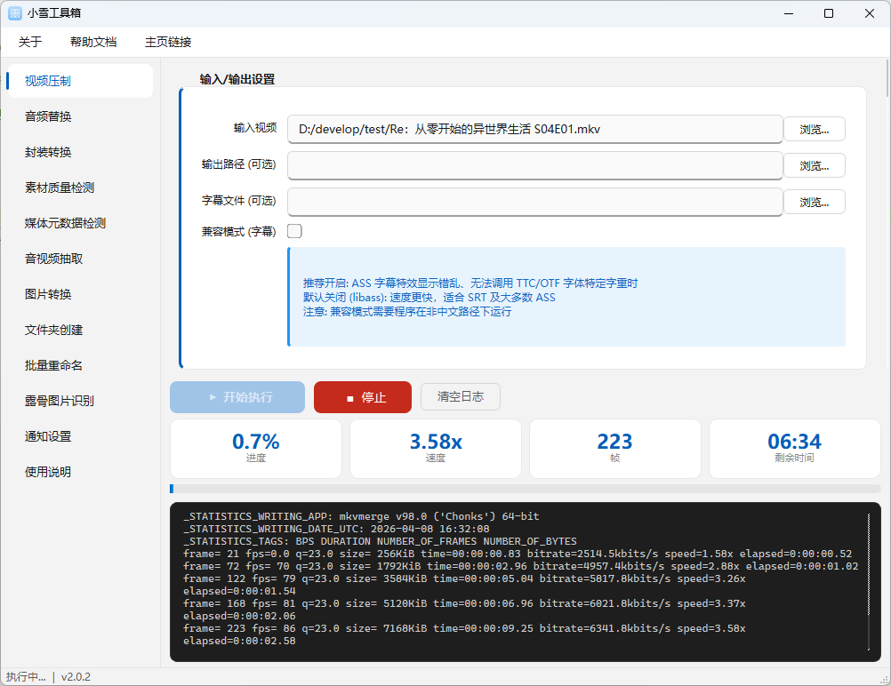
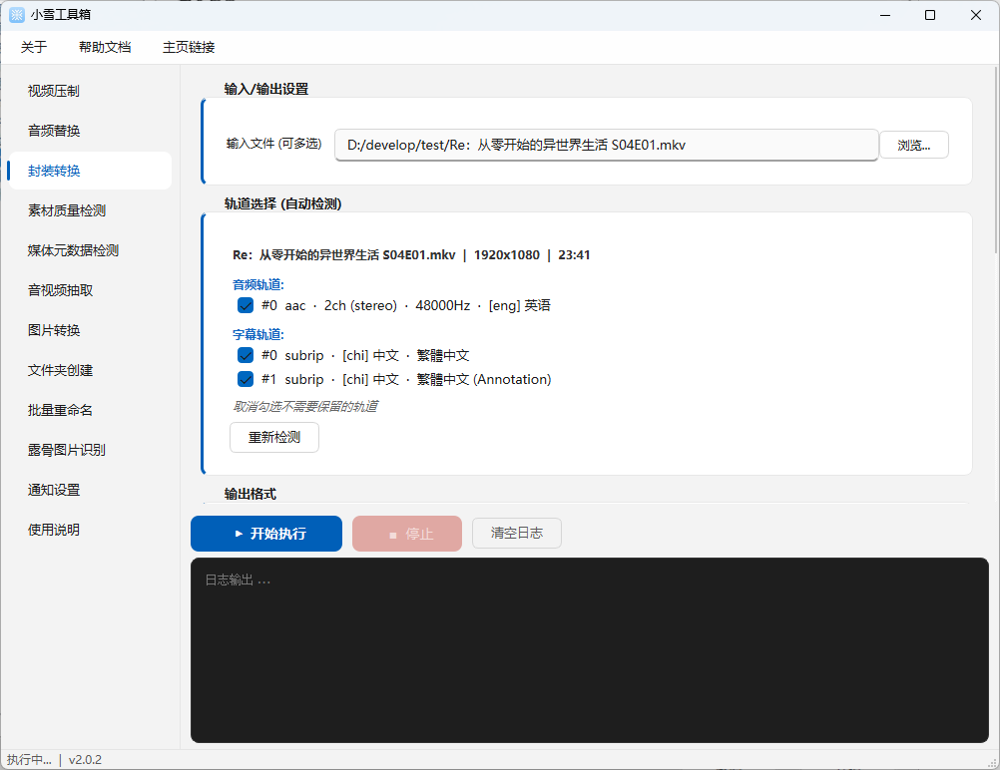
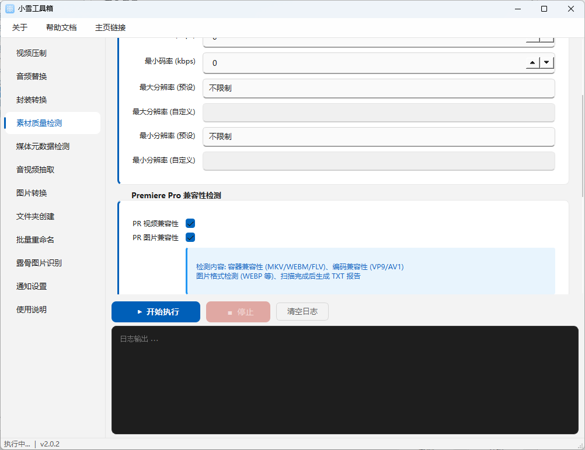
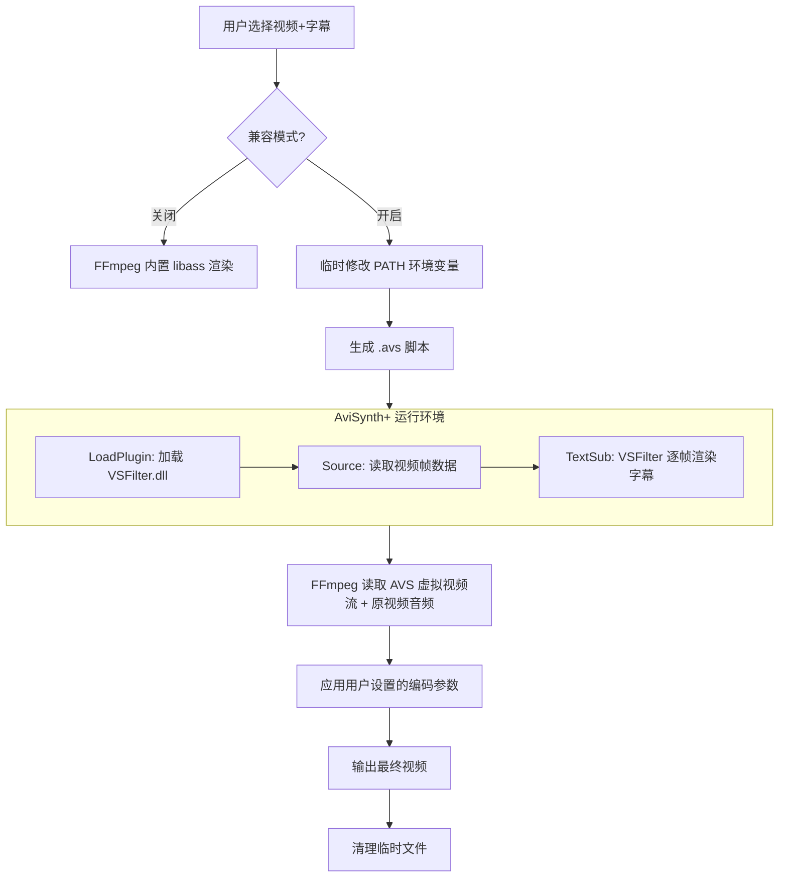

# 小雪工具箱 (XiaoXue Video Toolbox)

<p align="center">
  
</p>

<p align="center">
  
  
  
  
  
  
</p>


<p align="center">
一个简洁实用的视频压制与素材管理工具。基于 Python + Gooey 图形界面，内置 FFmpeg，开箱即用。
</p>

<p align="center">
  <a href="https://github.com/xueayi/XiaoXue-Video-Tools/wiki">项目首页</a> | 
  <a href="https://github.com/xueayi/XiaoXue-Video-Tools/wiki/Installation">安装部署</a> | 
  <a href="https://github.com/xueayi/XiaoXue-Video-Tools/wiki/%E5%B0%8F%E9%9B%AA%E5%B7%A5%E5%85%B7%E7%AE%B1%E4%BD%BF%E7%94%A8%E6%89%8B%E5%86%8C">使用手册</a> | 
  <a href="https://github.com/xueayi/XiaoXue-Video-Tools/wiki/FAQ">常见问题</a> | 
  <a href="https://github.com/xueayi/XiaoXue-Video-Tools/wiki/Development-Guide">开发指南</a>
</p>


---

## 功能一览





### 视频压制

支持 H.264/H.265 编码，内置四档画质预设，可选字幕烧录。

- **编码器**: CPU (libx264/libx265)、NVIDIA NVENC、Intel QSV、AMD AMF
- **码率控制**: CRF/CQ 恒定质量、VBR 可变码率、CBR 恒定码率、真 2-Pass 编码
- **NVENC 档位**: p1(最快) ~ p7(最慢) 可调
- **Debug 模式**: 仅输出 FFmpeg 命令，不实际执行

### 预设说明

| 预设        | 编码器     | 质量值 | 速度   | 适用场景    | 音频       |
| ----------- | ---------- | ------ | ------ | ----------- | ---------- |
| 均衡画质    | libx264    | CRF 18 | medium | 日常投稿    | 复制音频流 |
| 极致画质    | libx264    | CRF 16 | slow   | AMV/4K      | 复制音频流 |
| 速度优先    | h264_nvenc | CQ 23  | p4     | NVIDIA 加速 | 复制音频流 |
| 画质优先 HQ | h264_nvenc | CQ 19  | p7     | N 卡高画质  | 复制音频流 |

### 字幕兼容模式

当字幕字体显示异常时，可开启兼容模式：

- **便携设计**: 无需安装 AviSynth，解压即用
- **参数复用**: 所有编码参数与普通模式共用
- **自动清理**: 压制完成后自动删除临时文件
- **所见即所得**: 压制前用aegisub等软件预览字幕效果，与压制后看到的效果一致
- **使用场景**: 可以解决当无法调用TTC/OTF字体的内置字重时造成的字幕错误。
  
本模式需要程序在非中文路径下运行，否则会出错。



### 其他功能

- **封装转换**: MP4/MKV/MOV/TS/WEBM/MXF，不重新编码
- **素材质量检测**: 码率/分辨率/兼容性检测，生成报告
- **音频处理**: 音频替换、音频抽取
- **图片转换**: PNG/JPG/WEBP/BMP/GIF/TIFF 互转
- **批量文件管理**: 文件夹批量创建、序列重命名
- **任务通知**: 飞书通知、自定义 Webhook(可用于astrbot向QQ等消息平台推送任务完成消息)
- **露骨图片识别** *(Shield 增强版)*: B 站过审风险检测，自动打码

---

## 快速开始

### 从发布包运行

在 [Release](https://github.com/xueayi/XiaoXue-Video-Tools/releases) 页面下载：

| 版本                                           | 说明                              |
| ---------------------------------------------- | --------------------------------- |
| `XiaoXueToolbox_vX.X.X_Windows_x64.zip`        | 标准版，体积较小                  |
| `XiaoXueToolbox_vX.X.X_Shield_Windows_x64.zip` | Shield 增强版，含露骨图片识别功能 |

解压后双击 `XiaoXueToolbox.exe` 运行即可。

### 从源代码运行

```bash
# 1. 下载 FFmpeg 并放入 bin/ 目录
# 推荐: https://github.com/BtbN/FFmpeg-Builds/releases

# 2. 安装依赖
pip install -r requirements.txt

# 3. 运行程序
python main.py
```

### 运行测试

```bash
# 安装 pytest (已包含在 requirements.txt)
pip install pytest

# 运行所有测试
python -m pytest tests/test_encode_params.py -v --tb=short

# 运行特定测试类
python -m pytest tests/test_encode_params.py::TestNvencPresetOverride -v
```

---

## 许可证

本项目代码采用 **MIT License** 开源。

### 第三方组件声明

| 组件         | 许可证               | 说明                    |
| ------------ | -------------------- | ----------------------- |
| FFmpeg       | LGPL v2.1+ / GPL v2+ | 视频处理核心            |
| AviSynth     | GPL v2+              | 视频处理框架 (兼容模式) |
| LSMASHSource | ISC License          | 视频解码插件            |
| VSFilter     | GPL v2+              | 字幕渲染插件            |
| Gooey        | MIT                  | Python GUI 框架         |
| wxPython     | wxWidgets License    | GUI 底层组件            |

**注意**: 兼容模式使用的 AviSynth、LSMASHSource、VSFilter 均为开源组件。相关源代码可从各自的官方仓库获取。
